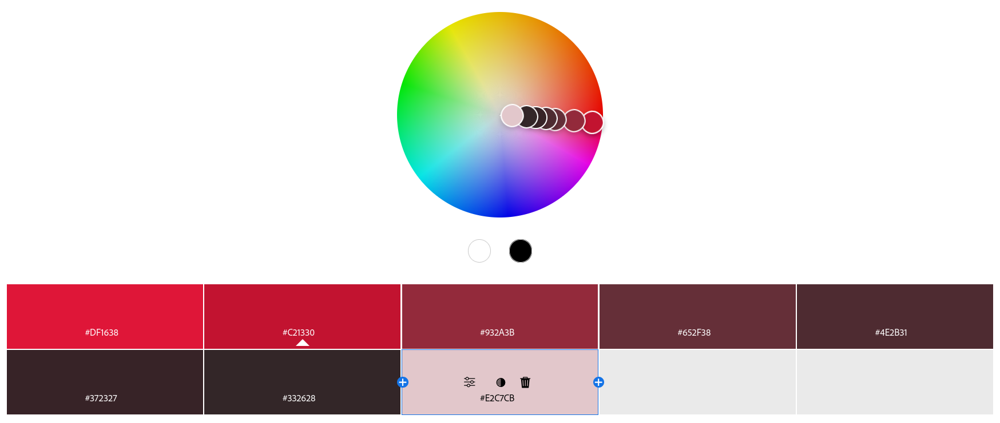

Katherine Tse Assignment 1 - Hello World: Basic Deployment w/ Git, GitHub, Glitch
===

Katherine Tse - 
http://a1-katherinetse.glitch.me

This project shows a single webpage with some information about me. The information includes:
* name
* class year
* majors
* on-campus activities
* hobbies
* cs courses I have taken at WPI
* other coding non-cs courses I have taken
* a brief description of my other coding experience 
* images of myself (more on that in the Technical Achievements section)
* links to other projects I have worked on at WPI

## Technical Achievements
- **Styled page with CSS**: Below is a list of all elements I styled and the rules applied.
  * <u>body</u> - added default font color from the color palette below for all non-header text (dark red brown #332628), set default font size to 1.2rem which is 1.2 times the size of the root element, set font for the entire webpage (more on that in the Design Achievements section)
  * <u>main</u> - added padding on the sides to give space between the edge of the page and the content 
  * <u>img</u> - set the max width of the image to be the width of the viewport 
  * <u>header, footer</u> - added background color from the color palette (light red #E2C7CB), aligned all text in these elements to the center 
  * <u>h1</u> - changed color of header to a color from the color palette (bright red #C21330)
  * <u>h2, h3, h4</u> - changed color of header to unique color from the color palette (h2: red #932A3B, h3: brick red #652F38, h4: dark red #4E2B31), removed margins around headers
  * <u>.sectionStart (div used to make headers)</u> - aligned text in section to center, made max width of the section to 35% of the screen width, centered entire element to the center of the main section, added background color from the color palette to match header and footer(light red #E2C7CB)
  * <u>table</u> - made width of table the width of the viewport, added a solid 2px border in a color form the color palette (dark brick red #372327)
  * <u>th</u> - set color of text to match h4 color from color palette (dark red #4E2B31), set font size to 1.2rem, added a solid 2px border to the header boxes in the same color as the table (dark brick red #372327)
  * <u>td</u> - set font size to 1.2rem, added a solid 2px border to the table boxes in the same color as the table (dark brick red #372327), added 5px of padding to each non-header box in the table 
  * <u>summary::marker</u> - removed the arrow that appears before the link to a dropdown 
  * <u>summary</u> - underlined text that controls the opening and closing of the dropdowns
  * <u>a:link</u> - changed color of links on page to a color from the color palette (fire-engine red #DF1638)
  * <u>a:hover</u> - changed color of links when hovered over to color from color palette (red #932A3B)
  * <u>button</u> - changed color of text to match the rest of the regular text (dark red brown #332628), changed background color to match the header, footer, and section titles (light red #E2C7CB), added 1px solid border in the same color as the table border (dark brick red #372327), rounded the corners of the button, added 5px margin under button
  * <u>button:hover</u> - changed text color of button when hovered over (red #932A3B)
- **Simple JavaScript Animation**: I used JS to make it so that clicking the button above the images on my website changes the image. There are three images that the program loops between. 
- **Semantic HTML Tags**: Below is a list of HTML tags that I added along with their uses.
  * header - allowed me to create and style a header section for my page
  * hr - adds a horizontal line to the page whenever called
  * main - allowed me to easily style all content not in the main section of the web page (i.e. not in the footer or header)
  * div - allowed me to wrap elements and create and style a 'section title' element that I reused by using the same class name for all instances
  * table - displayed content in a table 
  * ol - created an numbered list 
  * detail - created dropdown menu that can be opened and closed 
  * summary - let me set a caption/title for the dropdown menu (content still displayed when dropdown is closed and what is clicked to open/close the dropdown)
  * button - let me add a button that I then added functionality to with JS
  * img - let me add an image to the website which I animated with JS 
  * nav - easily created a display for links 
  * a - allowed me to add, display, and style links on the web page
  * footer - allowed me to create and style a footer section for my page

## Design Achievements
- **Created and Used Red Color Palette**: Generated red based monochromatic color palette from the [color.adobe.com](https://color.adobe.com) site. Use of each color can be found in the CSS section of the Technical Achievements. I chose red because of the red umbrellas in one of the images I chose. 

- **Used the Quicksand Font from Google Fonts**: I used Quicksand as the font for all text on my site. I chose this font because I tend to lean towards cute, simple, and rounded fonts. 
